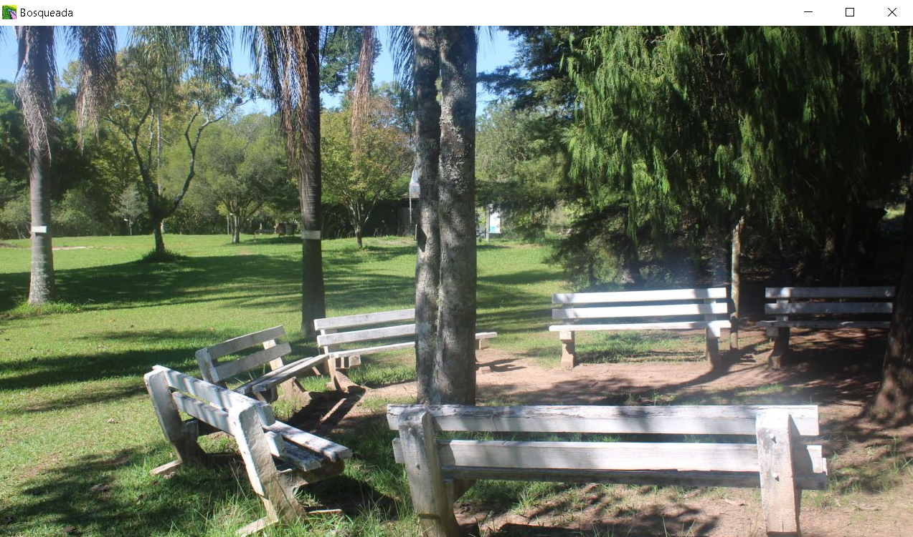

# Bosqueada

## Mini Progresso Print

### Ideia
   Adicionar perguntas no cenario, caso elas sejam respondidas corretamente o jogador recebe moedas e, com as moedas recebidas, ele podera ir para o proximo cenario, onde tera que enfrentar novas perguntas.

### Mudamos de Ideia
   Nossa antiga proposta criava um jogo chato, agora, iremos adicionar o personagem da Bosqueada, o Jaca, ele tera que desviar de meteoritos caidos do ceu e capturar as perguntas. Para ganhar e simples, sobreviva;

### Mudanca do Cenario

.png)

### Bosqueada esta de cara nova
   Com as novas texturas do mano Gatto a Bosqueada ganhou um novo visual, bem mais moderno, gostoso e com cristais roxinhos caindo do ceu.

.png)